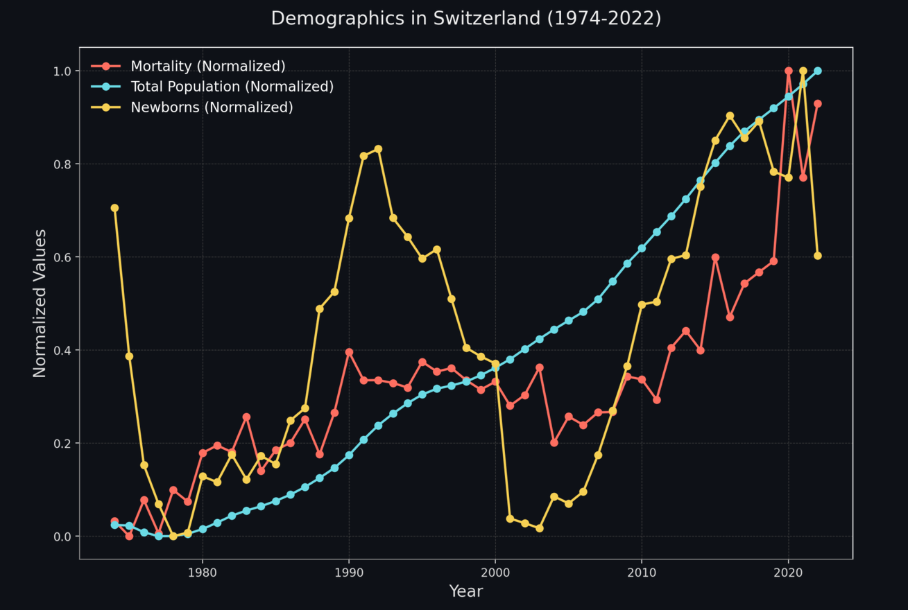

# World Bank Population Data Viewer

A simple and interactive Streamlit app to visualize population growth, mortality rates, and newborn statistics across various countries using data from the World Bank API.



---

## Features
- **Dropdown for Country Selection**: Select a country by its name from a dropdown menu.
- **Dynamic Plotting**: Generate an interactive plot for population metrics (Mortality, Newborns, Total Population).
- **API Integration**: Fetches real-time data from the World Bank API.

---

## Installation and Usage

### Prerequisites
Ensure you have Python installed (3.12.7). Install required dependencies:

```bash
pip install streamlit requests pandas matplotlib numpy
